# MEOVA
🎬 SSAFY 11기 관통 프로젝트 - 영화 추천 사이트

[추가: 시연 영상 넣고 싶음...]

## 📑 목차
1. 프로젝트 배경
2. 팀 구성 및 역할
3. 프로젝트 일정
4. 프로젝트 기획서
5. 프로젝트 수행 절차 및 방법
6. 프로젝트 수행 결과
7. AI적용시 사용 내역 (기능, 코드, 프롬프트)
8. 소감

## 1. 프로젝트 배경
### 기획 배경
- 가족/친구/연인 등과 함께 영화를 볼 때 ‘영화 뭐 보지?’ 고민하는 경험이 다수 있었다. 그러나 정보 과부하 시대에서 그때그때 적합한 추천 영화를 고르기도 쉽지 않은 일이다. 가족 영화라고 추천을 받아도 장면 중 노골적이거나 잔인한 장면 등이 있어 불편했던 경험이 있다.

⇒ 필요한 때에 빠르게, 간단하게 ‘함께’ 보기에 적합한 영화를 찾을 방법 없을까?

⇒ 메인 화면에 검색창을 두고 태그를 통해 검색한다면 어떨까? 검색 시간을 줄이고 접근성을 높일 수 있지 않을까?
### 개요

<aside>
    💡 MEOVA?

    “영화 뭐 봐?”에서 착안한 이름 MEOVA(머바)
    발음하기 쉬운 귀여운 어감과 MOVIE와 비슷한 스펠링으로 이용자에게 친숙한 이미지를 선사함
</aside>

- 기존 영화 플랫폼의 경우 메인 화면에 최신/인기/유저 기반 추천 영화들이 나열되어서 현재 이용자의 상황에 적합한 영화를 간단하게 찾기에는 어려움이 있었음
- 머바는 메인 화면에 직관적으로 검색창을 띄우고, 유저가 원하는 태그를 선택해 그에 기반해 영화 정보를 필터링하고 제공
- 영화 태그에 대한 간략한 코멘트를 구현해 이용자 경험 향상을 위한 서비스 제공
- AI 기술을 활용해 매일 웹사이트만의 독창적인 추천 영화 3개 제공
- 최신 영화, 인기 영화 정보 및 각종 영화의 상세 정보 및 감독/출연 배우 상세 정보 제공

<aside>
    🎬 목적

    최소 시간 최소 비용으로 관람할 영화를 손쉽게 추천받을 수 있는, 검색 기능에 중점을 둔 웹사이트
</aside>

## 2. 팀 구성 및 역할
### 팀명: 바조
- 김예운 (팀장)
    - 백엔드 / 프론트엔드
    - 영화 및 리뷰 기능 중심
- 윤채영
    - 백엔드 / 프론트엔드
    - 로그인 서버, 영화 및 리뷰 기능 중심

## 3. 프로젝트 일정
### Gantt Chart


- 5/5-5/10 프로젝트 구상 및 기획
- 5/13-5/16 프로젝트 모델 및 DB 설계, API 요청
- 5/16-5/22 프로젝트 백엔드 기능 구현 및 수정
- 5/18-5/23 프로젝트 프론트 구현 및 수정

## 4. 프로젝트 기획서

### 화면 및 기능 설계
💻 화면 설계 
- [figma](https://www.figma.com/proto/A5Q4TMCcsThwYGinL1q1aA/MOVIE?page-id=0%3A1&node-id=1-233&viewport=1091%2C-34%2C0.09&t=xA1Tlm1Y1lJSASJD-1&scaling=min-zoom&starting-point-node-id=1%3A233&show-proto-sidebar=1)

| 메인 화면                        | 검색 화면                     | 메인 영화 |
| ------------------------------- | ------------------------------|----|
| 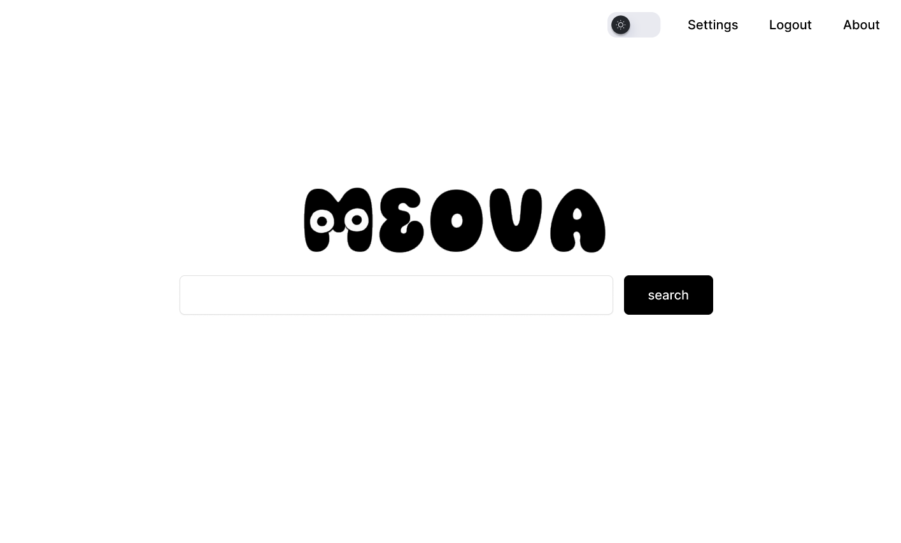 | 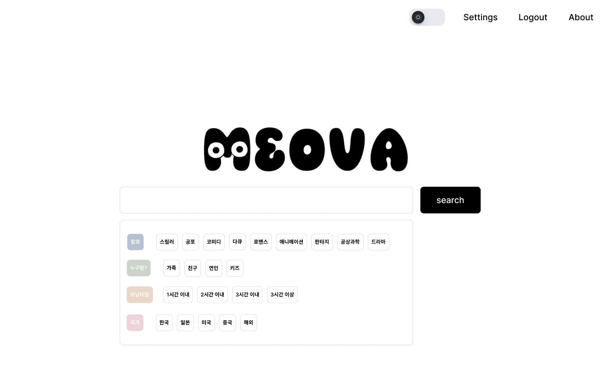 | 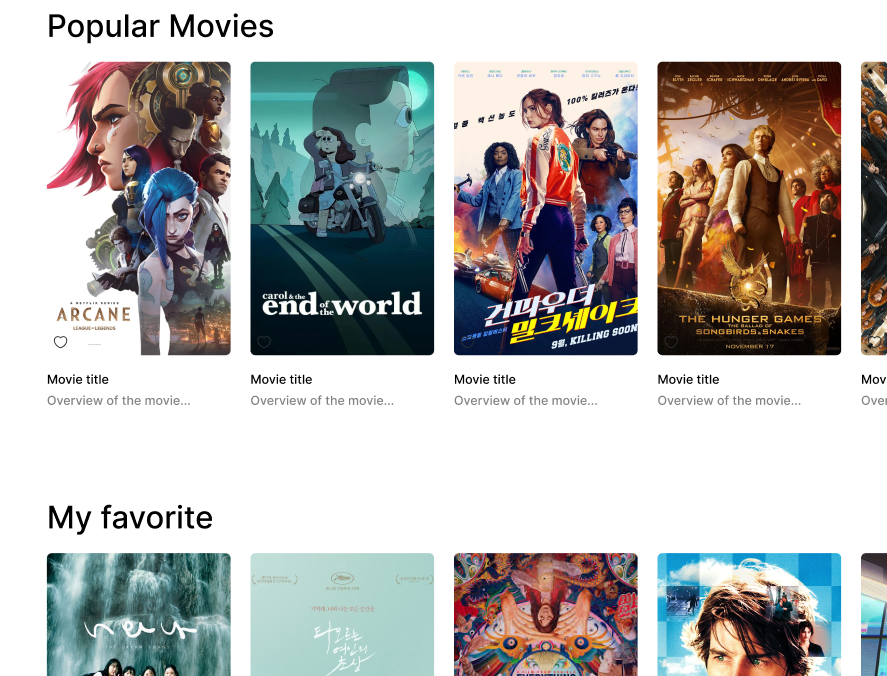|

| 유저 프로필                   | 영화 상세 정보                  | 배우 정보 |
| ---------------------------- | ------------------------------| ---|
| 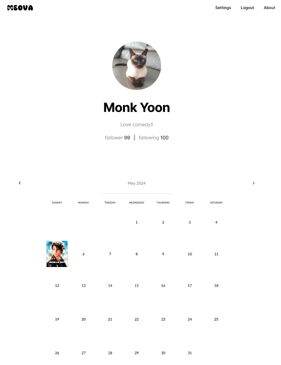  | 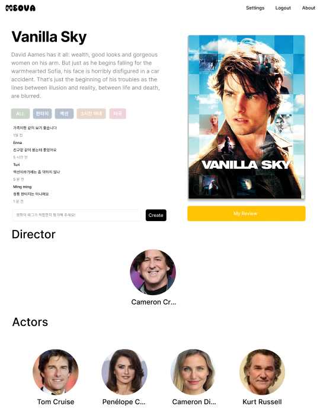 | 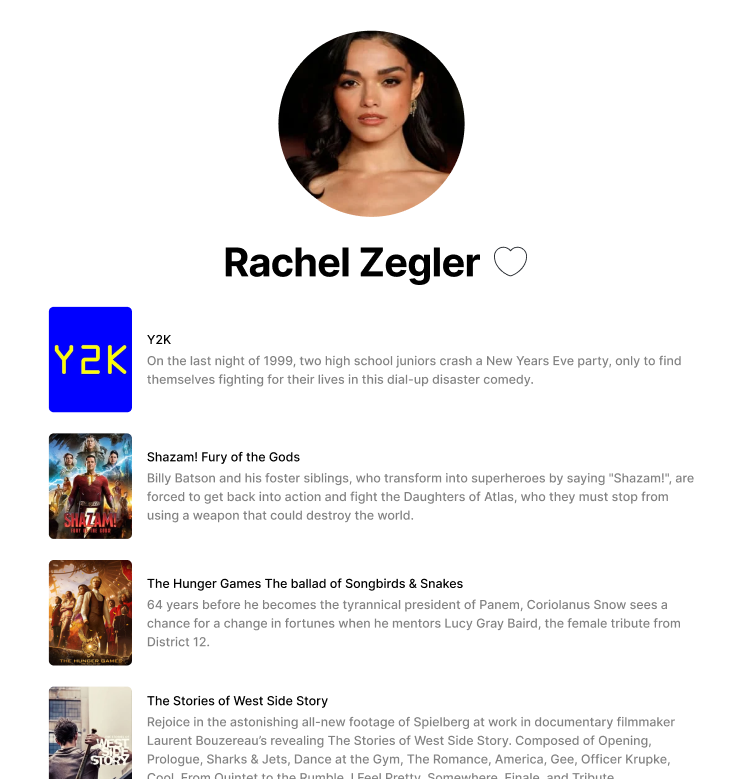|

<aside>
    ⚙ 기능 설계

    - 영화 추천
    - 영화 상세 정보 조회
    - 평점 및 리뷰 공유
    - 커뮤니티 기능
    - 태그 검색 기능
    - 태그 코멘트
    - 관람 기록 캘린더
    - 유저 추천 영화 리스트
    - 다크 모드
</aside>
<aside>

### Architecture 설계

### ERD

### 명세서
| 기능 명세서 | API 명세서 |
| --- | --- |
|  |  |
### Sequence Diagram
| USER Sequence Diagram | MOVIE Sequence Diagram |
| --- | --- |
|| |

## 5. 프로젝트 수행 절차 및 방법
### 일정 계획 및 공유
| 월간 일정 | 주간 일정 | 일일 일정 |
| --- | --- | --- |
|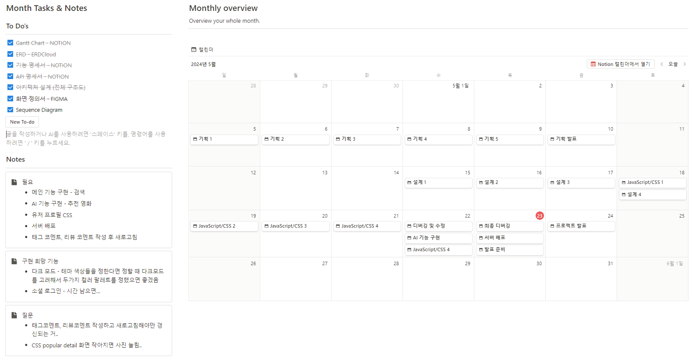|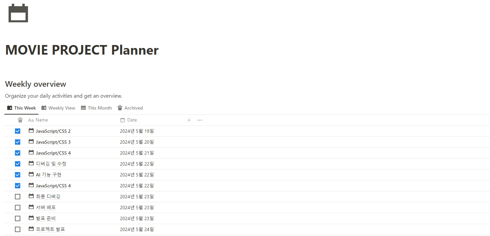|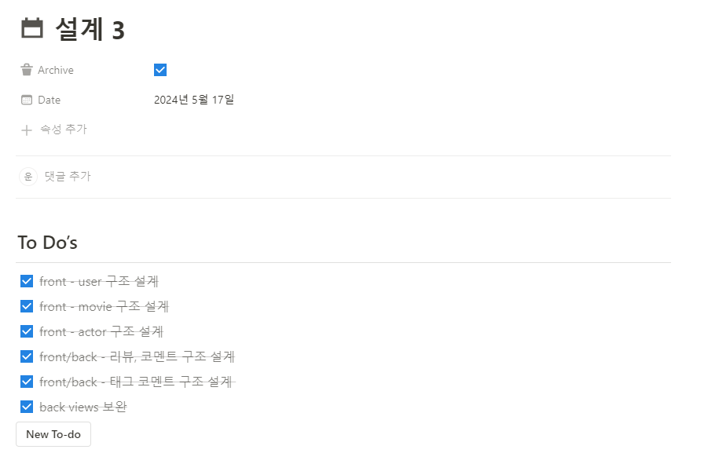|
### github 협업
| github1 | github2|
| --- | --- |
|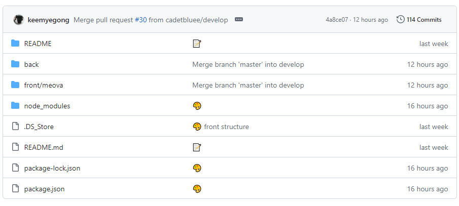 | 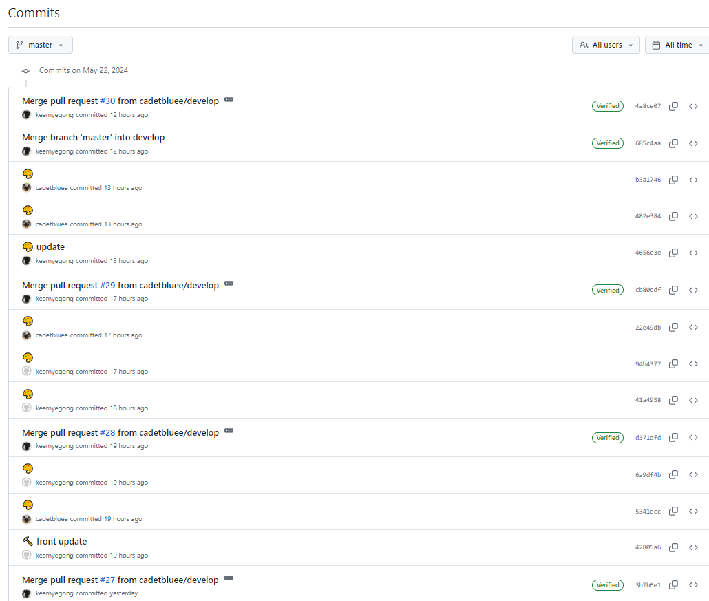 |

## 6. 프로젝트 수행 결과
<aside>
    ⚙ 구현 기능

    - 영화 태그 검색
    - AI 영화 추천
    - 영화 상세 정보 제공 (영화, 감독, 배우)
    - 태그 코멘트
    - 관람 기록 캘린더
    - 평점 및 리뷰 공유

</aside>

### 1. 메인 화면
메인창
### 1-1. 검색 화면
검색 태그창
검색 결과창
태그 이동창
### 1-2. 메인 추천 영화
추천, 인기, 최신 영화창 + 영화 좋아요
인기 영화 디테일
최신 영화 디테일
### 1-3. nav, footer
상단바 + 로그인/로그아웃시 버튼 전환
하단바

### 2. 영화 상세 정보
영화 디테일창
### 2-1. 태그 코멘트
태그 코멘트 작성창
태그 코멘트 디테일 + 태그 코멘트 삭제시 동적 변화
### 2-2. 감독
감독 상세 정보
### 2-3. 출연진
출연진 상세 정보

### 3. 리뷰 상세 정보
리뷰 디테일창 + 영화 디테일로 이동 + 리뷰 좋아요
### 3-1. 리뷰 CRUD
리뷰 작성창
리뷰 수정창
리뷰 삭제창
### 3-2. 리뷰 코멘트
리뷰 코멘트

### 4. 유저 프로필
유저 프로필창
### 4-1. 팔로워/팔로잉
팔로워/팔로잉 디테일창
### 4-2. 영화 캘린더
캘린더창
### 4-3. 유저 상세 정보
내가 작성한 리뷰
좋아하는 영화
좋아하는 리뷰
### 4-4. 유저 프로필 수정
프로필 업데이트창
비밀번호 변경창
회원 탈퇴

## 6. AI 활용 - 챗GPT
| 추천 영화 1                        | 추천 영화 2                     | 대기 상태 |
| ------------------------------- | ------------------------------|----|
| 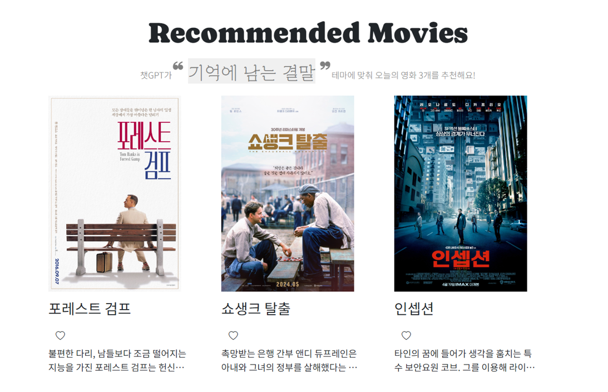 | 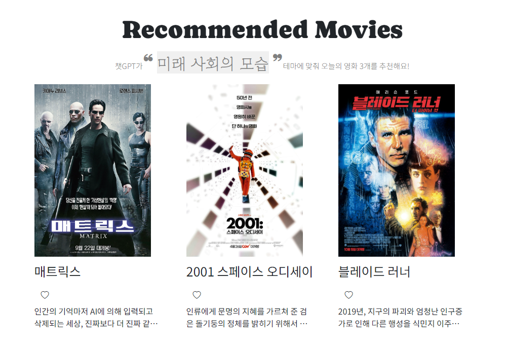 | |

<aside>
    🤖 기능

    AI가 직접 독창적인 테마 하나를 선정한 뒤, MEOVA의 영화 데이터베이스를 참조해 테마에 적합한 영화 세 가지를 선정해 추천
</aside>

  👾 AI 추천 알고리즘

- 서버에서 추천에 참조할 머바의 영화 데이터베이스 및 '독창적인 컨셉 하나를 정해서 그 컨셉에 맞는 영화 3개를 추천해줘'라는 구체적인 요구를 AI에게 input으로 전달
- 스크립트를 통해 AI의 답변 형식 지정
⇒ 지정 테마, 해당 영화의 ID를 반환하도록 함
```python
    movies = Movie.objects.all()
    movie_list = "\n".join([f"{movie.title}({movie.id}) " for movie in movies])
    input_message = request.query_params.get('message',
      '독창적인 컨셉 하나를 정해서 그 컨셉에 맞는 영화 3개를 추천해줘')
    prompt = f"{input_message}\n영화 목록:\n{movie_list}"
    messages=[
      {"role": "system", "content":  (
          "너는 영화 추천을 위한 chatbot이고 한글로 꼭 대답해야 해."
          "응답 형식은 항상 동일해야 하며, 다음 형식을 따라야 합니다:\n\n"
          "\"<테마>\"라는 컨셉으로 영화를 추천해드릴게요:\n\n"
          "1. **<영화 제목> (<영화 ID>)** - <영화 설명>\n"
          "2. **<영화 제목> (<영화 ID>)** - <영화 설명>\n"
          "3. **<영화 제목> (<영화 ID>)** - <영화 설명>\n\n"
          "이 세 개의 작품은 <테마> 컨셉에 맞추어 선정되었습니다.\""
          )
        },
      {"role": "user", "content": f"{prompt}"}]
```
- 반환값에서 공통된 패턴을 기준으로 지정된 테마 및 영화의 id 값 추출
```javascript
    {
    "id": 59,
    "message": "\"독창적인 세계관 속에서 모험을 떠나는 영웅들\"이라는 컨셉으로 영화를 추천해드릴게요:\n\n1. \
    **스타워즈 에피소드 4: 새로운 희망 (11)** - 은하계를 무대로 한 서사적 전투와 젊은 루크 스카이워커의 여정을 \
    그린 영화입니다.\n2. **반지의 제왕: 반지 원정대 (120)** - 중간계를 배경으로 한 판타지 모험 영화로, \
    프로도 배긴스가 사우론의 반지를 파괴하기 위해 떠나는 여정을 그립니다.\n3. **아바타 (19995)** - \
    판도라 행성에서 벌어지는 인류와 나비 족 간의 충돌을 그리며, 독창적이고 환상적인 세계관 속에서 펼쳐지는 이야기입니다.\n\n
    이 세 개의 작품은 \"독창적인 세계관 속에서 모험을 떠나는 영웅들\" 컨셉에 맞추어 선정되었습니다."
  }
```
```javascript
  const themeMatch =
    recommendations.value.message.match(/"(.+?)"이라는 컨셉/) ||
    recommendations.value.message.match(/"(.+?)"라는 컨셉/);
  theme.value = themeMatch ? themeMatch[1] : "테마 없음";

  const movieIdPattern = /\*\*.*?\((\d+)\)\*\*/g;
```


# 7. 프로젝트 소감